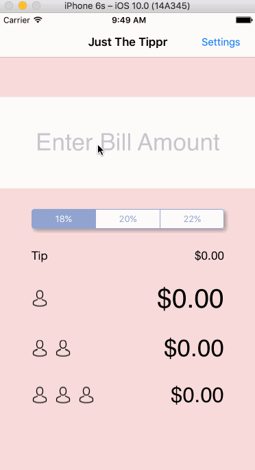

# TipCalculator

This is a Tip Calculator application for iOS submitted as the [pre-assignment](https://gist.github.com/timothy1ee/7747214) requirement for CodePath.

Time spent: 23 hours

Completed:

* [DONE] Required: User can enter a bill amount, choose a tip percentage, and see the tip and total values.
* [DONE] Required: Settings page to change the default tip percentage.
* [DONE] Optional: UI animations
* [DONE] Optional: Remembering the bill amount across app restarts (if <10mins)
* [DONE] Optional: Making sure the keyboard is always visible and the bill amount is always the first responder. This way the user doesn't have to tap anywhere to use this app. Just launch the app and start typing.
* [DONE] Optional: Add a light/dark color theme to the settings view. In viewWillAppear, update views with the correct theme colors.
* [DONE] Optional: Using locale-specific currency and currency thousands separators.
* [DONE] Optional: Added calculations for each person's bill if it was split 2 ways and 3 ways
* [DONE] Optional: Added App Icon
* [DONE] Optional: Added extension to UIColor class to accept color hex values
* [DONE] Optional: Added a navigation controller on the settings view, with back (bar) button

Notes: The animation works as shown below for iPhone 5S's screen size (my AutoLayout skills is still a work in-progress)

Acknowledgements:
GIF created with LiceCap. README file edited with Atom. Version control via Git, and hosting via Github. Debugging help via Stack Overflow and #swift on ios-developers.slack.com
